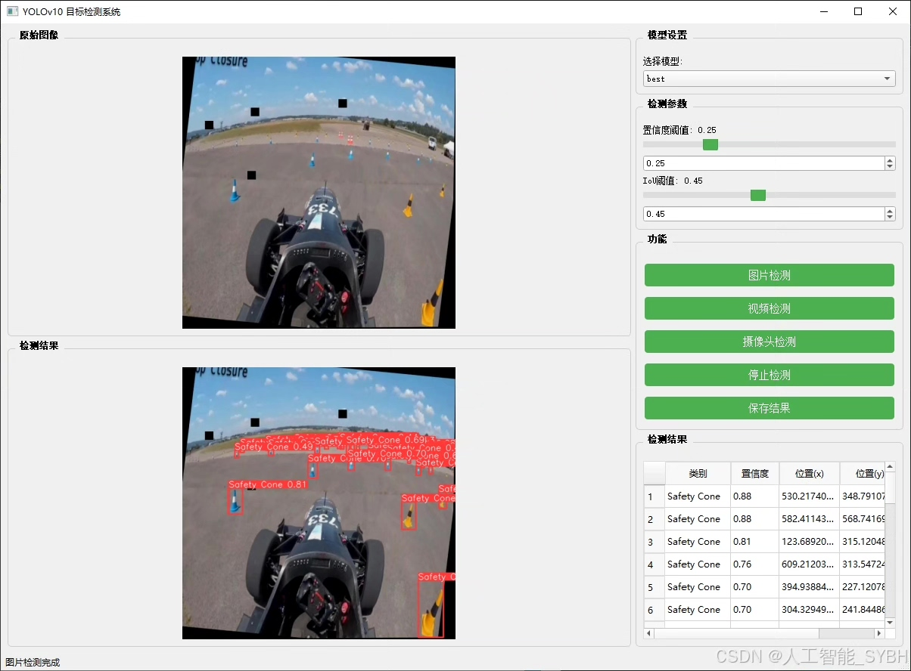
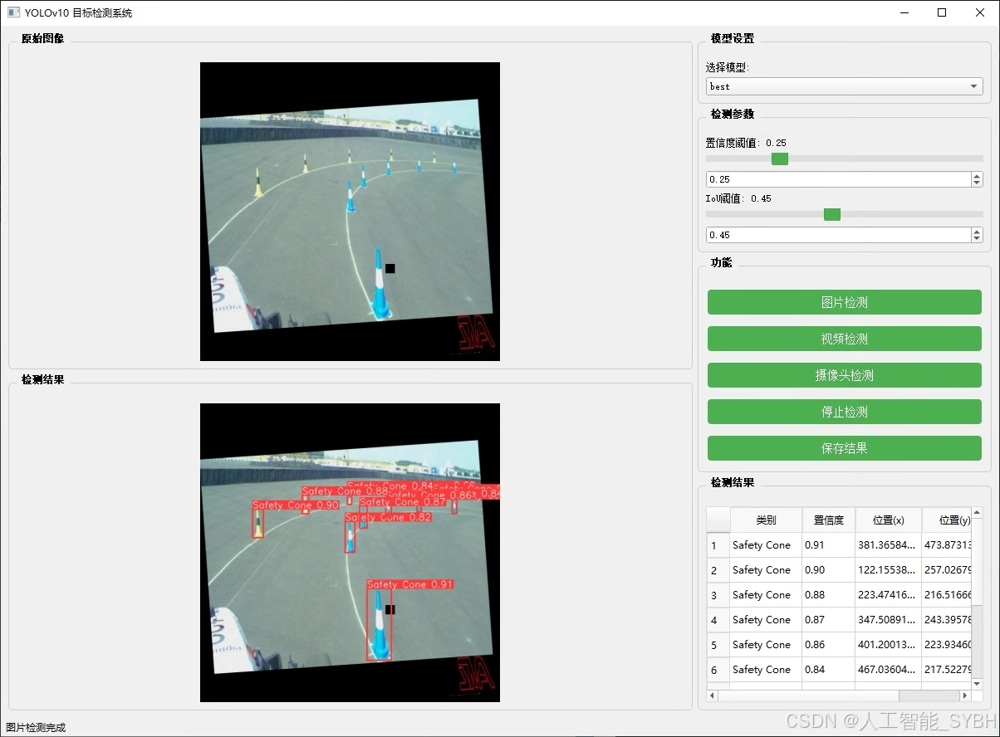
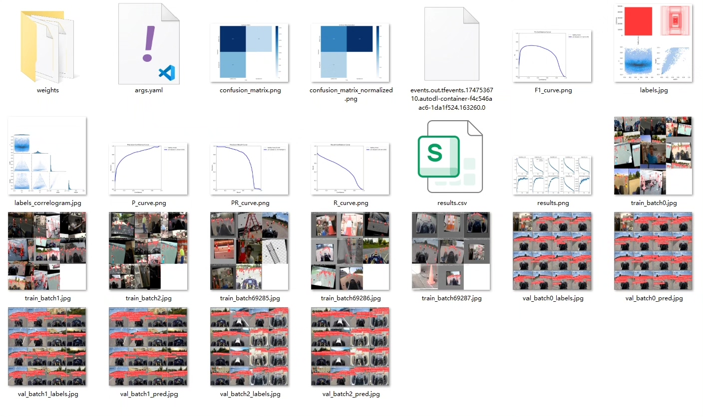
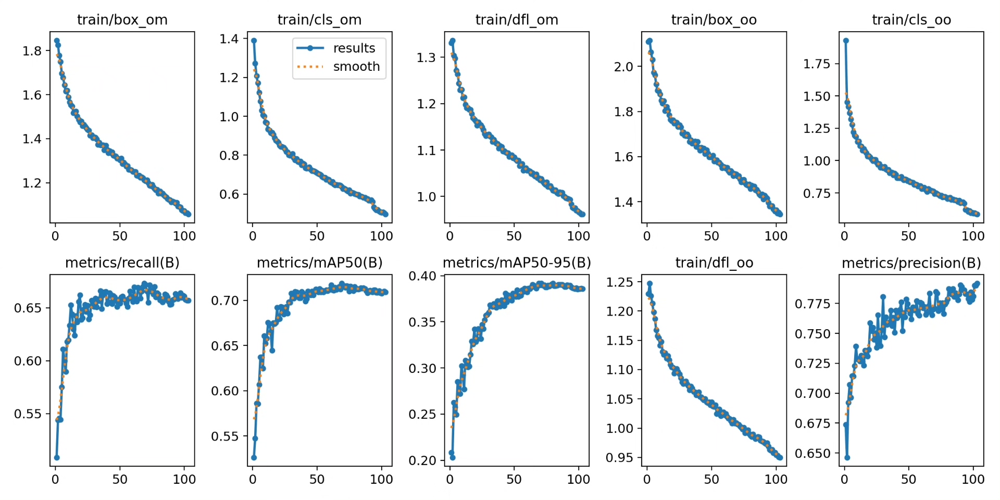
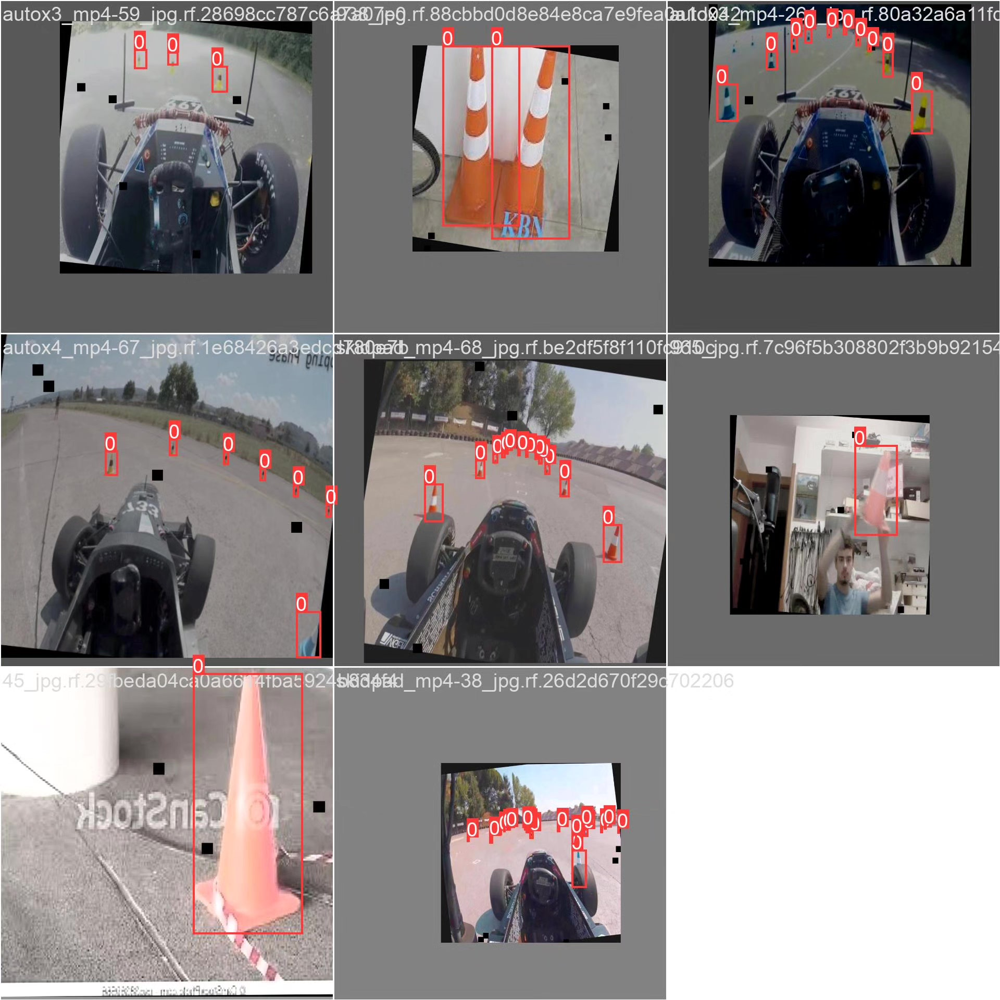
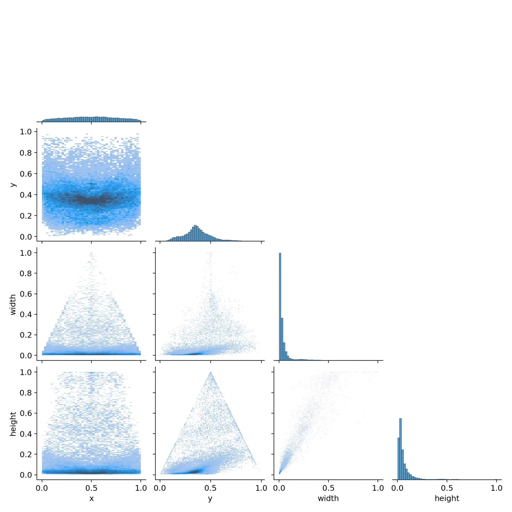
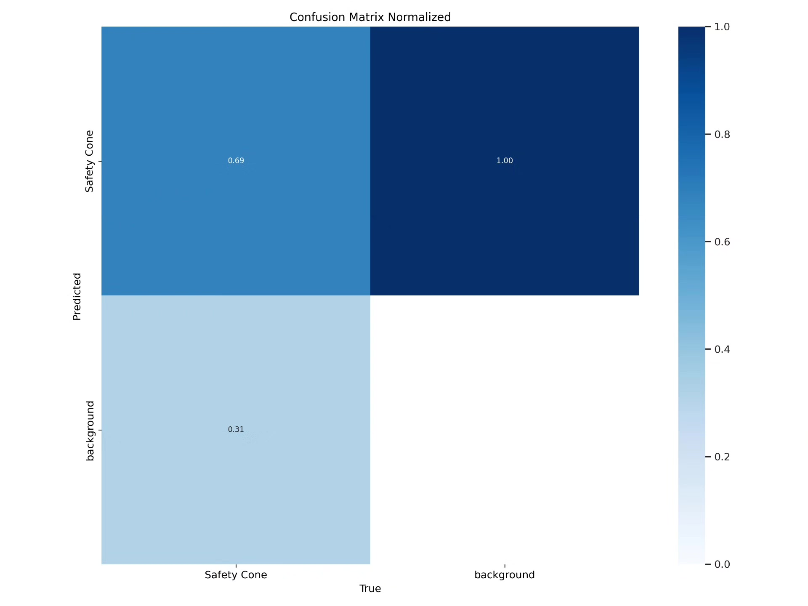

# Based on deep learning YOLOv10 for safety cone recognition detection system (YOLOv1)

## Body

Based on the YOLOv10 object detection algorithm, this project has developed a highly efficient and accurate safety cone recognition detection system. It is specifically designed for identifying safety cone facilities in road construction sites, traffic accidents, and other environments. The system can quickly locate and mark the position of safety cones in real-time video streams or static images through intelligent analysis. This provides technical support for road safety management, autonomous driving environment perception, and construction site monitoring. The project uses a self-built dataset containing 6,471 labeled images for training and validation, with 5,960 training images, 341 validation images, and 170 test images, achieving high accuracy in safety cone detection. This system can be widely applied in intelligent transportation systems, road construction safety monitoring, and assisted driving fields, holding significant practical value and social significance.

The company's products have obtained the official commercial license certification from YOLO.

We provide after-sales service:

After payment, we will provide WeChat ID to answer questions anytime.

Environmental configuration: We will provide an instructional tutorial on environmental configuration, and WeChat will provide answers.

Remote installation service: If you need remote configuration, an additional fee of 69 is required.
If the configuration fails, all fees will be refunded (only the installation fee is refunded for older computers).

Retraining dataset: After setting up the environment, you can train on your own computer.
If you need us to retrain, just pay 69 plus computing power fees (2.5 yuan/hour)

## Images

## Payment

Here is a pay link on Stripe ( https://buy.stripe.com/3cs8yP7sY87d0vu9AB ). Please contact me lonlonago@foxmail.com after funding $89, and I will send you a complete data files , thank you!

